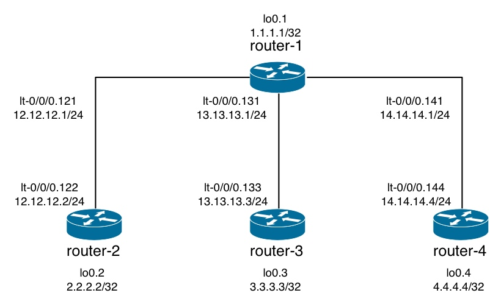
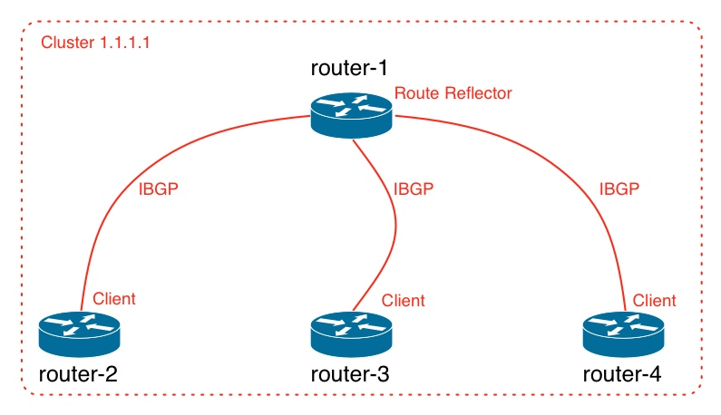

# BGP Simple Route Reflector

This example illustrates the configuration of a Border Gateway Protocol (BGP) Route Reflector (RR).

This is a simple route reflector scenario:

* No redundant route reflectors.
* No hierarchical route reflectors.
* A single cluster.
* Use physical interface addreses for IBGP sessions (as opoosed to loopback addresses).

## Topology

### Physical Topology



### Protocols



## Configuration

### Physical Topology

```
## Last changed: 2012-11-05 11:27:14 UTC
version "12.2I0 [slt-builder]";
system {
    root-authentication {
        encrypted-password "$1$3RRU14Td$9NyynPTnDBN82m79i1uG10"; ## SECRET-DATA
    }
    services {
        ssh;
        web-management {
            http {
                interface ge-0/0/0.0;
            }
        }
    }
    syslog {
        file messages {
            any any;
        }
    }
    license {
        autoupdate {
            url https://ae1.juniper.net/junos/key_retrieval;
        }
    }
}
interfaces {
    ge-0/0/0 {
        unit 0 {
            family inet {
                address 192.168.229.155/24;
            }
        }
    }
    lt-0/0/0 {
        unit 121 {
            encapsulation frame-relay;
            dlci 12;
            peer-unit 122;
            family inet {
                address 12.12.12.1/24;
            }
        }
        unit 122 {
            encapsulation frame-relay;
            dlci 12;
            peer-unit 121;
            family inet {
                address 12.12.12.2/24;
            }
        }
        unit 131 {
            encapsulation frame-relay;
            dlci 13;
            peer-unit 133;
            family inet {
                address 13.13.13.1/24;
            }
        }
        unit 133 {
            encapsulation frame-relay;
            dlci 13;
            peer-unit 131;
            family inet {
                address 13.13.13.3/24;
            }
        }
        unit 141 {
            encapsulation frame-relay;
            dlci 14;
            peer-unit 144;
            family inet {
                address 14.14.14.1/24;
            }
        }
        unit 144 {
            encapsulation frame-relay;
            dlci 14;
            peer-unit 141;
            family inet {
                address 14.14.14.4/24;
            }
        }
    }
    lo0 {
        unit 1 {
            family inet {
                address 1.1.1.1/32;
            }
        }
        unit 2 {
            family inet {
                address 2.2.2.2/32;
            }
        }
        unit 3 {
            family inet {
                address 3.3.3.3/32;
            }
        }
        unit 4 {
            family inet {
                address 4.4.4.4/32;
            }
        }
    }
}
security {
    forwarding-options {
        family {
            mpls {
                mode packet-based;
            }
        }
    }
    zones {
        security-zone trust {
            tcp-rst;
            host-inbound-traffic {
                system-services {
                    all;
                }
                protocols {
                    all;
                }
            }
            interfaces {
                ge-0/0/0.0;
            }
        }
    }
}
routing-instances {
    router-1 {
        instance-type virtual-router;
        interface lt-0/0/0.121;
        interface lt-0/0/0.131;
        interface lt-0/0/0.141;
        interface lo0.1;
    }
    router-2 {
        instance-type virtual-router;
        interface lt-0/0/0.122;
        interface lo0.2;
    }
    router-3 {
        instance-type virtual-router;
        interface lt-0/0/0.133;
        interface lo0.3;
    }
    router-4 {
        instance-type virtual-router;
        interface lt-0/0/0.144;
        interface lo0.4;
    }
}
```

### BGP Configuration


```
[edit]
+  policy-options {
+      policy-statement direct-routes {
+          from protocol direct;
+          then accept;
+      }
+  }
[edit routing-instances router-1]
+    routing-options {
+        autonomous-system 100;
+    }
+    protocols {
+        bgp {
+            group clients {
+                type internal;
+                export direct-routes;
+                cluster 1.1.1.1;
+                neighbor 12.12.12.2;
+                neighbor 13.13.13.3;
+                neighbor 14.14.14.4;
+            }
+        }
+    }
[edit routing-instances router-2]
+    routing-options {
+        autonomous-system 100;
+    }
+    protocols {
+        bgp {
+            group internal {
+                type internal;
+                export direct-routes;
+                neighbor 12.12.12.1;
+            }
+        }
+    }
[edit routing-instances router-3]
+    routing-options {
+        autonomous-system 100;
+    }
+    protocols {
+        bgp {
+            group internal {
+                type internal;
+                export direct-routes;
+                neighbor 13.13.13.1;
+            }
+        }
+    }                                  
[edit routing-instances router-4]
+    routing-options {
+        autonomous-system 100;
+    }
+    protocols {
+        bgp {
+            group internal {
+                type internal;
+                export direct-routes;
+                neighbor 14.14.14.1;
+            }
+        }
+    }
```

## Validation

### BGP Session Summary

All BGP sessions are up on router-1:

```
root> show bgp summary instance router-1    
Groups: 1 Peers: 3 Down peers: 0
Table          Tot Paths  Act Paths Suppressed    History Damp State    Pending
route.inet.0           6          3          0          0          0          0
Peer                     AS      InPkt     OutPkt    OutQ   Flaps Last Up/Dwn State|#Active/Received/Accepted/Damped...
12.12.12.2              100          3          6       0       0          11 Establ
  router-1.inet.0: 1/2/2/0
13.13.13.3              100          3          5       0       0           7 Establ
  router-1.inet.0: 1/2/2/0
14.14.14.4              100          3          5       0       0           3 Establ
```

The BGP session is up on router-2:

```
root> show bgp summary instance router-2    
Groups: 1 Peers: 1 Down peers: 0
Table          Tot Paths  Act Paths Suppressed    History Damp State    Pending
route.inet.0           6          5          0          0          0          0
Peer                     AS      InPkt     OutPkt    OutQ   Flaps Last Up/Dwn State|#Active/Received/Accepted/Damped...
12.12.12.1              100          8          6       0       0        1:16 Establ
  router-2.inet.0: 5/6/6/0
```

The BGP session is up on router-3:

```
root> show bgp summary instance router-3    
Groups: 1 Peers: 1 Down peers: 0
Table          Tot Paths  Act Paths Suppressed    History Damp State    Pending
route.inet.0           6          5          0          0          0          0
Peer                     AS      InPkt     OutPkt    OutQ   Flaps Last Up/Dwn State|#Active/Received/Accepted/Damped...
13.13.13.1              100          9          8       0       0        2:01 Establ
  router-3.inet.0: 5/6/6/0
```

The BGP session is up on router-4:

```
root> show bgp summary instance router-4    
Groups: 1 Peers: 1 Down peers: 0
Table          Tot Paths  Act Paths Suppressed    History Damp State    Pending
route.inet.0           6          5          0          0          0          0
Peer                     AS      InPkt     OutPkt    OutQ   Flaps Last Up/Dwn State|#Active/Received/Accepted/Damped...
14.14.14.1              100          9          8       0       0        2:16 Establ
  router-4.inet.0: 5/6/6/0
```


### BGP Neighbor

The details for BGP neighbor 12.12.12.2 on router-1. Note that neighbor 12.12.12.1 is a route reflector client:

<pre>
root> show bgp neighbor 12.12.12.2 instance router-1    
Peer: 12.12.12.2+179 AS 100    Local: 12.12.12.1+59347 AS 100  
  Type: Internal    State: Established  <b><em>(route reflector client)</em></b>Flags: <ImportEval Sync>
  Last State: OpenConfirm   Last Event: RecvKeepAlive
  Last Error: None
  Export: [ direct-routes ] 
  Options: <Preference Cluster Refresh>
  Holdtime: 90 Preference: 170
  Number of flaps: 0
  Peer ID: 2.2.2.2         Local ID: 1.1.1.1           Active Holdtime: 90
  Keepalive Interval: 30         Peer index: 0   
  BFD: disabled, down
  NLRI for restart configured on peer: inet-unicast
  NLRI advertised by peer: inet-unicast
  NLRI for this session: inet-unicast
  Peer supports Refresh capability (2)
  Stale routes from peer are kept for: 300
  Peer does not support Restarter functionality
  NLRI that restart is negotiated for: inet-unicast
  NLRI of received end-of-rib markers: inet-unicast
  NLRI of all end-of-rib markers sent: inet-unicast
  Peer supports 4 byte AS extension (peer-as 100)
  Peer does not support Addpath
  Table router-1.inet.0 Bit: 10000
    RIB State: BGP restart is complete
    RIB State: VPN restart is complete
    Send state: in sync
    Active prefixes:              1
    Received prefixes:            2
    Accepted prefixes:            2
    Suppressed due to damping:    0
    Advertised prefixes:          6
  Last traffic (seconds): Received 11   Sent 2    Checked 50  
  Input messages:  Total 11     Updates 2       Refreshes 0     Octets 247
  Output messages: Total 14     Updates 3       Refreshes 0     Octets 459
  Output Queue[0]: 0
</pre>

The details for BGP neighbor 12.12.12.2 on router-2:

```
root> show bgp neighbor 12.12.12.1 instance router-2    
Peer: 12.12.12.1+59347 AS 100  Local: 12.12.12.2+179 AS 100  
  Type: Internal    State: Established    Flags: <ImportEval Sync>
  Last State: OpenConfirm   Last Event: RecvKeepAlive
  Last Error: None
  Export: [ direct-routes ] 
  Options: <Preference Refresh>
  Holdtime: 90 Preference: 170
  Number of flaps: 0
  Peer ID: 1.1.1.1         Local ID: 2.2.2.2           Active Holdtime: 90
  Keepalive Interval: 30         Peer index: 0   
  BFD: disabled, down
  NLRI for restart configured on peer: inet-unicast
  NLRI advertised by peer: inet-unicast
  NLRI for this session: inet-unicast
  Peer supports Refresh capability (2)
  Stale routes from peer are kept for: 300
  Peer does not support Restarter functionality
  NLRI that restart is negotiated for: inet-unicast
  NLRI of received end-of-rib markers: inet-unicast
  NLRI of all end-of-rib markers sent: inet-unicast
  Peer supports 4 byte AS extension (peer-as 100)
  Peer does not support Addpath
  Table router-2.inet.0 Bit: 20000
    RIB State: BGP restart is complete
    RIB State: VPN restart is complete
    Send state: in sync
    Active prefixes:              5
    Received prefixes:            6
    Accepted prefixes:            6
    Suppressed due to damping:    0
    Advertised prefixes:          2
  Last traffic (seconds): Received 5    Sent 5    Checked 26  
  Input messages:  Total 37     Updates 4       Refreshes 0     Octets 877
  Output messages: Total 35     Updates 1       Refreshes 0     Octets 762
  Output Queue[1]: 0
```

### BGP Routes

BGP routes on router-1:

```
root> show route protocol bgp table router-1.inet.0       

router-1.inet.0: 10 destinations, 13 routes (10 active, 0 holddown, 0 hidden)
+ = Active Route, - = Last Active, * = Both

2.2.2.2/32         *[BGP/170] 00:16:30, localpref 100
                      AS path: I
                    > to 12.12.12.2 via lt-0/0/0.121
3.3.3.3/32         *[BGP/170] 00:16:26, localpref 100
                      AS path: I
                    > to 13.13.13.3 via lt-0/0/0.131
4.4.4.4/32         *[BGP/170] 00:16:22, localpref 100
                      AS path: I
                    > to 14.14.14.4 via lt-0/0/0.141
12.12.12.0/24       [BGP/170] 00:16:30, localpref 100
                      AS path: I
                    > to 12.12.12.2 via lt-0/0/0.121
13.13.13.0/24       [BGP/170] 00:16:26, localpref 100
                      AS path: I
                    > to 13.13.13.3 via lt-0/0/0.131
14.14.14.0/24       [BGP/170] 00:16:22, localpref 100
                      AS path: I
                    > to 14.14.14.4 via lt-0/0/0.141
```

BGP routes on router-2:

```
root> show route protocol bgp table router-2.inet.0    

router-2.inet.0: 8 destinations, 9 routes (8 active, 0 holddown, 0 hidden)
+ = Active Route, - = Last Active, * = Both

1.1.1.1/32         *[BGP/170] 00:17:08, localpref 100
                      AS path: I
                    > to 12.12.12.1 via lt-0/0/0.122
3.3.3.3/32         *[BGP/170] 00:17:04, localpref 100
                      AS path: I
                    > to 12.12.12.1 via lt-0/0/0.122
4.4.4.4/32         *[BGP/170] 00:17:00, localpref 100
                      AS path: I
                    > to 12.12.12.1 via lt-0/0/0.122
12.12.12.0/24       [BGP/170] 00:17:08, localpref 100
                      AS path: I
                    > to 12.12.12.1 via lt-0/0/0.122
13.13.13.0/24      *[BGP/170] 00:17:08, localpref 100
                      AS path: I
                    > to 12.12.12.1 via lt-0/0/0.122
14.14.14.0/24      *[BGP/170] 00:17:08, localpref 100
                      AS path: I
                    > to 12.12.12.1 via lt-0/0/0.122
```

### BGP Route Details

Details for BGP route 2.2.2.2/32 on router-1. This a route on the route reflector which was received from a client. The route does not yet have originator and cluster-list attributes yet:

```
root> show route 2.2.2.2 table router-1.inet.0 detail 

router-1.inet.0: 10 destinations, 13 routes (10 active, 0 holddown, 0 hidden)
2.2.2.2/32 (1 entry, 1 announced)
        *BGP    Preference: 170/-101
                Next hop type: Indirect
                Address: 0x9348f40
                Next-hop reference count: 4
                Source: 12.12.12.2
                Next hop type: Router, Next hop index: 677
                Next hop: 12.12.12.2 via lt-0/0/0.121, selected
                Protocol next hop: 12.12.12.2
                Indirect next hop: 93d4000 262142
                State: <Active Int Ext>
                Local AS:   100 Peer AS:   100
                Age: 20:19      Metric2: 0 
                Task: BGP_100_100.12.12.12.2+179
                Announcement bits (3): 0-BGP_RT_Background 1-KRT 2-Resolve tree 2 
                AS path: I
                Accepted
                Localpref: 100
                Router ID: 2.2.2.2
```

Details for BGP route 2.2.2.2/32 on router-3. This is a route which was reflected by the route reflector. The route has originator and cluster-list attributes:

<pre>
router-3.inet.0: 8 destinations, 9 routes (8 active, 0 holddown, 0 hidden)
2.2.2.2/32 (1 entry, 1 announced)
        *BGP    Preference: 170/-101
                Next hop type: Indirect
                Address: 0x9348b08
                Next-hop reference count: 3
                Source: 13.13.13.1
                Next hop type: Router, Next hop index: 570
                Next hop: 13.13.13.1 via lt-0/0/0.133, selected
                Protocol next hop: 12.12.12.2
                Indirect next hop: 93d43a0 262146
                State: <Active Int Ext>
                Local AS:   100 Peer AS:   100
                Age: 20:34      Metric2: 0 
                Task: BGP_100_100.13.13.13.1+57444
                Announcement bits (2): 1-KRT 2-Resolve tree 3 
                AS path: I <b><em>(Originator) Cluster list:  1.1.1.1</em></b>
                AS path:  <b><em>Originator ID: 2.2.2.2</em></b>
                Accepted
                Localpref: 100
                Router ID: 1.1.1.1
</pre>

### Traceroute

Traceroute router-2 to router-4:

```
root> traceroute 4.4.4.4 source 2.2.2.2 routing-instance router-2 
traceroute to 4.4.4.4 (4.4.4.4) from 2.2.2.2, 30 hops max, 40 byte packets
 1  12.12.12.1 (12.12.12.1)  4.284 ms  3.910 ms  3.988 ms
 2  4.4.4.4 (4.4.4.4)  3.973 ms  3.643 ms  3.882 ms
```
