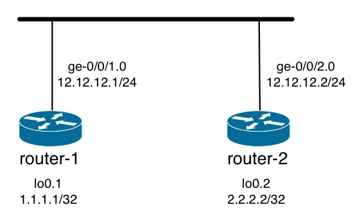
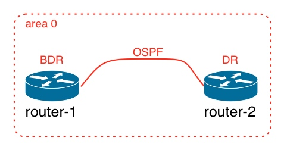

# OSPF LAN Adjacency

This example explores the state machine for establishing an OSPF adjacency over a LAN connection.

## Topology

### Physical Topology



### Protocols



## Configuration

### Physical Topology

```
## Last changed: 2012-11-07 09:33:58 UTC
version "12.2I0 [slt-builder]";
system {
    root-authentication {
        encrypted-password "$1$3RRU14Td$9NyynPTnDBN82m79i1uG10"; ## SECRET-DATA
    }
    services {
        ssh;
        web-management {
            http {
                interface ge-0/0/0.0;
            }
        }
    }
    syslog {
        file messages {
            any any;
        }
    }
    license {
        autoupdate {
            url https://ae1.juniper.net/junos/key_retrieval;
        }
    }
}
interfaces {
    ge-0/0/0 {
        unit 0 {
            family inet {
                address 192.168.229.155/24;
            }
        }
    }
    ge-0/0/1 {
        unit 0 {
            family inet {
                address 12.12.12.1/24;
            }
        }
    }
    ge-0/0/2 {
        unit 0 {
            family inet {
                address 12.12.12.2/24;
            }
        }
    }
    lo0 {
        unit 1 {
            family inet {
                address 1.1.1.1/32;
            }
        }
        unit 2 {
            family inet {
                address 2.2.2.2/32;
            }
        }
    }
}
security {
    forwarding-options {
        family {
            mpls {
                mode packet-based;
            }
        }
    }
    zones {
        security-zone trust {
            tcp-rst;
            host-inbound-traffic {
                system-services {
                    all;
                }
                protocols {
                    all;
                }
            }
            interfaces {
                ge-0/0/0.0;
            }
        }
    }
}
routing-instances {
    router-1 {
        instance-type virtual-router;
        interface ge-0/0/1.0;
        interface lo0.1;
    }
    router-2 {
        instance-type virtual-router;
        interface ge-0/0/2.0;
        interface lo0.2;
    }
}
```

### OSPF Configuration


```
[edit routing-instances router-1]
+    protocols {
+        ospf {
+            area 0.0.0.0 {
+                interface ge-0/0/1.0;
+                interface lo0.1;
+            }
+        }
+    }
[edit routing-instances router-2]
+    protocols {
+        ospf {
+            area 0.0.0.0 {
+                interface ge-0/0/2.0;
+                interface lo0.2;
+            }
+        }
+    }
```

## Validation

### OSPF Interfaces

OSPF interfaces on router-1. Note that router-1 is the Backup Designated Router (BDR) on the LAN:

<pre>
root> show ospf interface instance router-1 
Interface           State   Area            DR ID           BDR ID          Nbrs
ge-0/0/1.0          <font color="red">BDR</font>     0.0.0.0         <font color="red">2.2.2.2</font>         <font color="red">1.1.1.1</font>            1
lo0.1               DR      0.0.0.0         1.1.1.1         0.0.0.0            0
</pre>

OSPF interfaces on router-2. Note that router-2 is the Designated Router (DR) on the LAN:

<pre>
root> show ospf interface instance router-2    
Interface           State   Area            DR ID           BDR ID          Nbrs
ge-0/0/2.0          <font color="red">DR</font>      0.0.0.0         <font color="red">2.2.2.2</font>         <font color="red">1.1.1.1</font>            1
lo0.2               DR      0.0.0.0         2.2.2.2         0.0.0.0            0
</pre>

### OSPF Neighbors

OSPF neighbors on router-1:

```
root> show ospf neighbor instance router-1 detail       
Address          Interface              State     ID               Pri  Dead
12.12.12.2       ge-0/0/1.0             Full      2.2.2.2          128    37
  Area 0.0.0.0, opt 0x52, DR 12.12.12.2, BDR 12.12.12.1
  Up 00:09:34, adjacent 00:09:02
```

OSPF neighbors on router-2:

```
root> show ospf neighbor instance router-2 detail    
Address          Interface              State     ID               Pri  Dead
12.12.12.1       ge-0/0/2.0             Full      1.1.1.1          128    34
  Area 0.0.0.0, opt 0x52, DR 12.12.12.2, BDR 12.12.12.1
  Up 00:10:49, adjacent 00:10:17
```

### OSPF Routes

OSPF routes on router-1:

```
root> show ospf route instance router-1    
Topology default Route Table:

Prefix             Path  Route      NH       Metric NextHop       Nexthop      
                   Type  Type       Type            Interface     Address/LSP
2.2.2.2            Intra Router     IP            1 ge-0/0/1.0    12.12.12.2
1.1.1.1/32         Intra Network    IP            0 lo0.1
2.2.2.2/32         Intra Network    IP            1 ge-0/0/1.0    12.12.12.2
12.12.12.0/24      Intra Network    IP            1 ge-0/0/1.0
```

OSPF routes on router-2:

```
root> show ospf route instance router-2    
Topology default Route Table:

Prefix             Path  Route      NH       Metric NextHop       Nexthop      
                   Type  Type       Type            Interface     Address/LSP
1.1.1.1            Intra Router     IP            1 ge-0/0/2.0    12.12.12.1
1.1.1.1/32         Intra Network    IP            1 ge-0/0/2.0    12.12.12.1
2.2.2.2/32         Intra Network    IP            0 lo0.2
12.12.12.0/24      Intra Network    IP            1 ge-0/0/2.0
```

### Traceroute

Traceroute from router-1 to router-2:

```
root> traceroute 2.2.2.2 source 1.1.1.1 routing-instance router-1 
traceroute to 2.2.2.2 (2.2.2.2) from 1.1.1.1, 30 hops max, 40 byte packets
 1  2.2.2.2 (2.2.2.2)  6.491 ms  7.281 ms  5.985 ms
```
