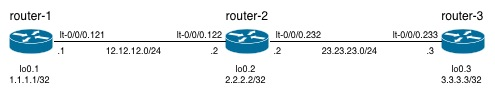

# Three Node Linear

## Description

The three-node-linear topology consists of three routers in a linear configuration connected by point-to-point links:



## Sanity Checks

Ping from routing-instance router-1 to routing-instance router-2:

```
root> ping 12.12.12.2 routing-instance router-1 
PING 12.12.12.2 (12.12.12.2): 56 data bytes
64 bytes from 12.12.12.2: icmp_seq=0 ttl=64 time=1.399 ms
64 bytes from 12.12.12.2: icmp_seq=1 ttl=64 time=2.242 ms
```

Ping from routing-instance router-2 to routing-instance router-3:

```
root> ping 23.23.23.3 routing-instance router-2    
PING 23.23.23.3 (23.23.23.3): 56 data bytes
64 bytes from 23.23.23.3: icmp_seq=0 ttl=64 time=0.681 ms
64 bytes from 23.23.23.3: icmp_seq=1 ttl=64 time=2.320 ms
```

Details on routing-instance route-1:

```
root> show route instance router-1 detail    
router-1:
  Router ID: 1.1.1.1
  Type: virtual-router    State: Active        
  Interfaces:
    lt-0/0/0.121
    lo0.1
  Tables:
    router-1.inet.0        : 3 routes (3 active, 0 holddown, 0 hidden)
```

Routes in IPv4 unicast RIB of routing-instance router-1:

```
root> show route table router-1.inet.0       

router-1.inet.0: 3 destinations, 3 routes (3 active, 0 holddown, 0 hidden)
+ = Active Route, - = Last Active, * = Both

1.1.1.1/32         *[Direct/0] 00:03:29
                    > via lo0.1
12.12.12.0/24      *[Direct/0] 00:03:29
                    > via lt-0/0/0.121
12.12.12.1/32      *[Local/0] 00:03:29
                      Local via lt-0/0/0.121
```