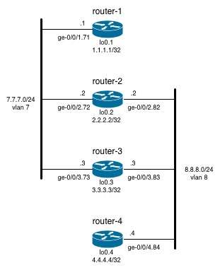

# Two Three Node LANs


## Description

The two-three-node-lans topology consists of four routers connected by two LANs each connected to three of the four routers:



## Sanity Checks

Ping from routing-instance router-1 to routing-instance router-2 over VLAN 7

```
root> ping routing-instance router-1 7.7.7.2 
PING 7.7.7.2 (7.7.7.2): 56 data bytes
64 bytes from 7.7.7.2: icmp_seq=0 ttl=64 time=1.465 ms
64 bytes from 7.7.7.2: icmp_seq=1 ttl=64 time=0.258 ms
64 bytes from 7.7.7.2: icmp_seq=2 ttl=64 time=4.364 ms
```

Ping from routing-instance router-2 to routing-instance router-3 over VLAN 8

```
root> ping routing-instance router-2 8.8.8.3    
PING 8.8.8.3 (8.8.8.3): 56 data bytes
64 bytes from 8.8.8.3: icmp_seq=0 ttl=64 time=6.490 ms
64 bytes from 8.8.8.3: icmp_seq=1 ttl=64 time=6.207 ms
64 bytes from 8.8.8.3: icmp_seq=2 ttl=64 time=6.338 ms
```

Details on routing-instance router-2

```
root> show route instance router-2 
Instance             Type
         Primary RIB                                     Active/holddown/hidden
router-2             virtual-router 
         router-2.inet.0                                 5/0/0

root> show route instance router-2 detail 
router-2:
  Router ID: 2.2.2.2
  Type: virtual-router    State: Active        
  Interfaces:
    ge-0/0/2.82
    ge-0/0/2.72
    lo0.2
  Tables:
    router-2.inet.0        : 5 routes (5 active, 0 holddown, 0 hidden)
```

Routes in IPv4 unicast RIB of routing-instance router-2:

```
root> show route table router-2.inet.0
root> show route table router-2.inet.0 

router-2.inet.0: 5 destinations, 5 routes (5 active, 0 holddown, 0 hidden)
+ = Active Route, - = Last Active, * = Both

2.2.2.2/32         *[Direct/0] 00:20:40
                    > via lo0.2
7.7.7.0/24         *[Direct/0] 00:20:23
                    > via ge-0/0/2.72
7.7.7.2/32         *[Local/0] 00:20:24
                      Local via ge-0/0/2.72
8.8.8.0/24         *[Direct/0] 00:20:23
                    > via ge-0/0/2.82
8.8.8.2/32         *[Local/0] 00:20:24
                      Local via ge-0/0/2.82       
```